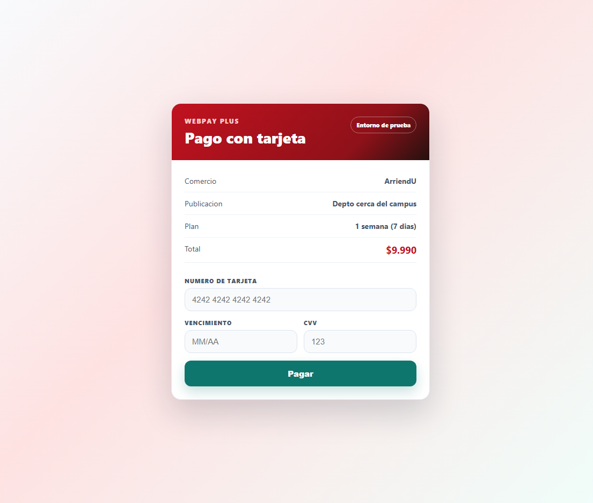
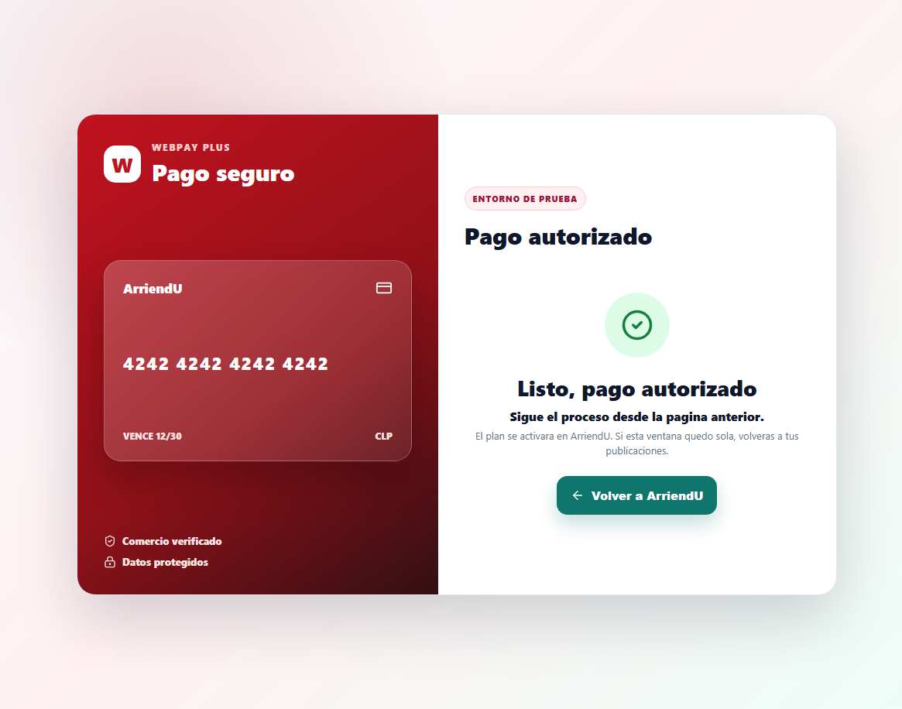

# Patrocinio de publicaciones

El flujo de patrocinio permite que un arrendador destaque una publicacion desde `Mis publicaciones`.

## Implementacion

El patrocinio queda asociado directamente a la publicacion. No se creo una tabla nueva; se extendio la entidad `Publicacion` con estos campos:

- `patrocinada`: booleano que indica si la publicacion esta destacada.
- `patrocinadaHasta`: fecha de termino del plan contratado.
- `patrocinioMetodo`: medio usado para activarlo (`webpay` o `transferencia`).
- `patrocinioMonto`: monto del plan seleccionado.

El proyecto usa TypeORM con `synchronize: true`, por lo que en desarrollo estas columnas se crean desde la entidad. En un ambiente sin sincronizacion automatica se debe agregar una migracion equivalente.

La activacion valida que el usuario sea arrendador, que la publicacion le pertenezca y que no este `inactiva` ni `arrendada`. El listado publico ordena primero las publicaciones patrocinadas y luego aplica el orden normal solicitado.

## Flujo

1. El arrendador presiona el boton con trueno en una publicacion activa.
2. Selecciona un plan de promocion: `1 dia`, `1 semana` o `1 mes`.
3. Confirma el plan y elige medio de pago.
4. Si elige WebPay, se abre una ventana de autorizacion con formulario de tarjeta.
5. Al autorizar el pago, WebPay muestra `Sigue el proceso desde la pagina anterior`.
6. La pagina anterior recibe la aprobacion y activa el plan con el endpoint real:

```http
POST /api/publicacion/:id/patrocinio
```

Payload esperado:

```json
{
  "metodoPago": "webpay",
  "monto": 9990,
  "plan": "destacado_1_semana",
  "vigenciaDias": 7
}
```

La opcion de transferencia sigue siendo una confirmacion dentro de la app y usa el mismo endpoint cuando termina la espera.

## WebPay simulado

La pasarela WebPay es una pantalla frontend en `/webpay`. Al abrirla, `MisPublicaciones.jsx` genera un `token` y guarda una orden pendiente en `localStorage` con:

- `publicacionId`
- plan seleccionado
- monto
- dias de vigencia
- ruta de retorno `returnTo`

Esto evita que el pago quede sin contexto si la pestaña de WebPay se recarga o queda sola. Cuando no existe `window.opener`, WebPay usa ese contexto guardado para activar el plan y volver a `/publicacion/:id`.

La tarjeta no procesa un pago real. Solo valida formato de numero, vencimiento y CVV, espera una autorizacion simulada y luego avisa a la pagina anterior o ejecuta el fallback contra el endpoint real.

## Editar o cortar patrocinio

Cuando una publicacion ya esta destacada, el boton con trueno abre una gestion del patrocinio:

- `Editar plan`: vuelve al selector de planes y, luego del pago, actualiza el destaque desde ese momento.
- `Cortar patrocinio`: desactiva el destaque inmediatamente con el endpoint real:

```http
DELETE /api/publicacion/:id/patrocinio
```

## Capturas

Formulario WebPay:



Pago aprobado:


